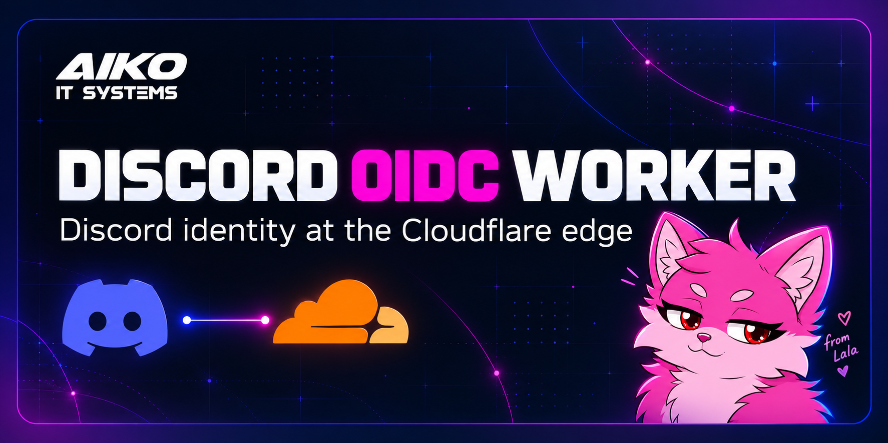

# Discord OIDC Worker



This Worker lets Cloudflare Access use Discord as an OpenID Connect identity provider. It supports PKCE, Discord profile claims, optional guild and role claims, and KV or D1 role caching.

## How to install?

Run `npm run setup` for the interactive setup, or read [the setup guide](docs/setup.md) to configure everything by hand.

## How to run?

```sh
npm install
npm run start
```

## How to test without posting?

```sh
npm test
npm run typecheck
```

For a real Discord login against a local Worker, follow the local test section in [the development guide](docs/development.md). It listens on localhost and does not deploy.

## How to update?

See [development and code changes](docs/development.md) for the source layout, checks, and deployment command.

Upgrading an existing v4 install? Follow the [v4 to v5 migration guide](docs/migrating-v4-to-v5.md).

## Help

Ask in the [AITSYS Discord server](https://discord.gg/RXA6u3jxdU), or open an issue using one of the repository's issue forms.

The project is licensed under MIT. See [LICENSE](LICENSE).

## Credits

The original project and core idea came from [Erisa](https://github.com/Erisa/discord-oidc-worker). This Worker has since been redesigned and extended for AITSYS. Other references include [kimcore/discord-oidc](https://github.com/kimcore/discord-oidc) and [eidam/cf-access-workers-oidc](https://github.com/eidam/cf-access-workers-oidc).
